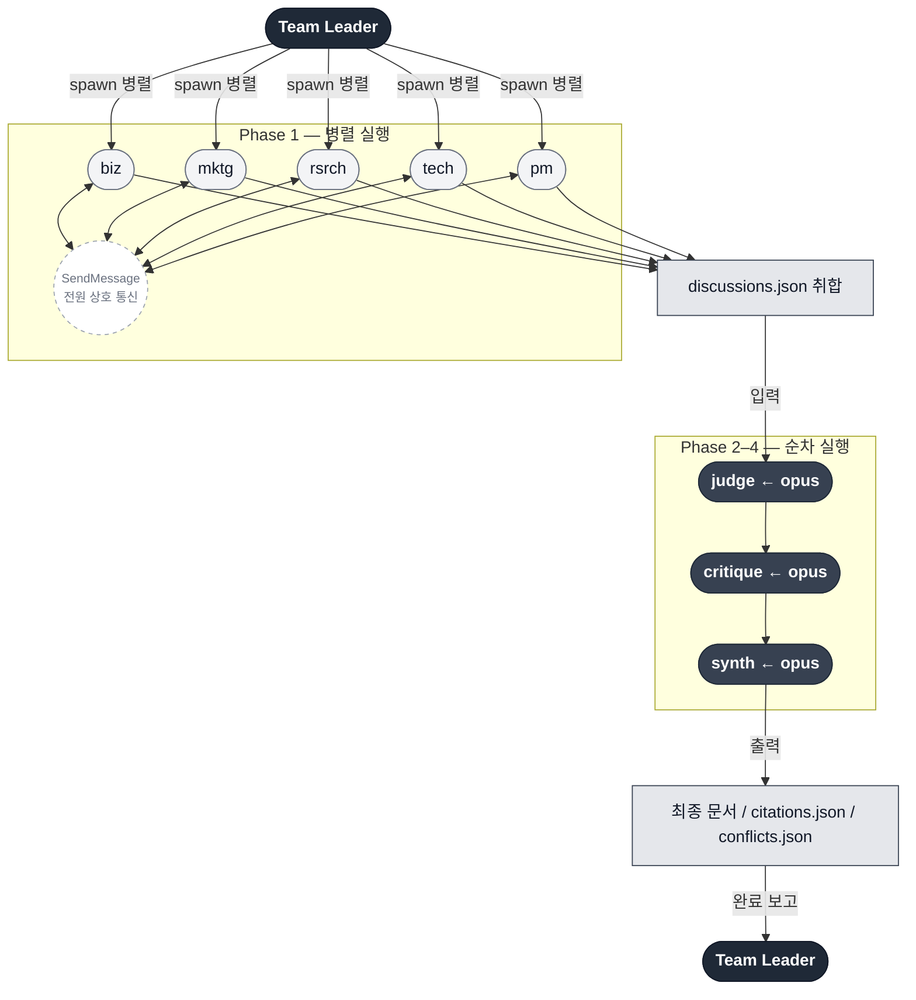

# Agent Team Specification (Single Source of Truth)

이 문서는 문서 생성 에이전트 팀의 **유일한 정의 문서**입니다.
모든 명령어와 에이전트는 이 사양을 참조해야 합니다.

> **동적 에이전트 로스터**: 실행 시 `.claude/spec/document-types.yaml`의 `agent_roles.wave1`에 의해
> 활성 역할이 결정됩니다. 아래 6역할 중 문서 유형에 해당하는 에이전트만 실행됩니다.

---

## 역할 로스터 (8역할)

| # | Role ID | 한국어명 | 책임 범위 |
|---|---------|---------|----------|
| 1 | `biz` | 비즈니스/전략 | 비즈니스 목표, 성공 지표, 경쟁 환경, 시장 기회 |
| 2 | `marketing` | 마케팅/GTM | 포지셔닝, 메시징 필러, 채널 전략, 런칭 계획 |
| 3 | `research` | 리서치 | 사용자 인사이트, 증거 맵, 가정 검증, 미지 영역 |
| 4 | `tech` | 기술 | 기술 타당성, 아키텍처, 통합, 비기능 요구사항 |
| 5 | `pm` | PM | 스코프(in/out), 요구사항, 마일스톤, 수용 기준, 의존성 |
| 6 | `judge` | 판정관 | 회의 중 발생한 미해결 충돌에 대해 서술형 판정(승/패/무승부) 작성, 합의점 도출 |
| 7 | `critique` | 비판적 검토 | 전체 결과(토론 기록 포함) 교차 검토, 논리적 오류/모순/누락 식별, 개선 권고 |
| 8 | `synth` | 통합/종합 | 토론+판정+비평 결과 머지, 충돌 해결, 최종 문서 작성 (문서 유형에 따라 구조 결정) |

---

## 실행 패턴



---

### 회의 (Discussion) — 전원 동시, peer-to-peer 실시간 소통

모든 도메인 에이전트(biz, marketing, research, tech, pm + 동적 역할)가 동시에 실행됩니다.
각 에이전트는 `.claude/knowledge/evidence/` 내 증거 청크를 분석하면서,
**분석 도중** 다른 에이전트에게 직접 `SendMessage`를 보내 질문·반박·합의를 진행합니다.
에이전트 간 실시간 peer-to-peer 소통을 통해 cross-domain 이슈를 즉시 조율합니다.

### 판정 (Judge) — 순차, 회의 완료 후

judge 에이전트가 회의 중 발생한 토론 기록(`peer_discussions`)과 최종 출력을 검토합니다.
미해결 충돌(`outcome: "unresolved"`)에 대해 서술형 판정(승/패/무승부)을 내리고 합의점을 도출합니다.

### 비평 (Critique) — 순차, 판정 완료 후

critique 에이전트가 전체 결과(에이전트 출력 + 토론 기록 + 판정 결과)를 읽고 비판적으로 검토합니다.
논리적 오류, 근거 없는 주장, 역할 간 모순, 누락된 관점을 식별하고 synth를 위한 개선 권고를 제공합니다.

### 통합 (Synth) — 순차, 비평 완료 후

synth 에이전트가 회의 결과, 판정, 비평을 모두 읽고 최종 문서를 생성합니다.
Judge의 `adopted_for_synth` 필드를 요구사항 결정 시 우선 반영합니다.
문서 구조는 `document-types.yaml`의 `output_sections`를 따릅니다.

---

## 모델 선택

각 에이전트에 할당되는 모델은 `.claude/spec/model-selection-spec.md`를 따릅니다.

- **회의(Discussion) 기본**: `sonnet` (단일 도메인 구조화 분석)
- **판정/비평/통합 기본**: `opus` (토론 판정, 교차 검토, 다중 소스 통합, 최종 문서 작성)
- 프로젝트별/문서 유형별 오버라이드 가능 (`project.json` > `document-types.yaml` > 기본값)

---

## 팀 통신 규칙 (TeamCreate 모드)

### 팀원 공통 절차 (Live Meeting Mode)

1. `TaskList`로 태스크 확인
2. `TaskUpdate`로 클레임 (owner + in_progress)
3. 증거 분석 시작
4. **분석 도중 cross-domain 이슈 발견 시**:
   - 해당 에이전트에게 직접 `SendMessage`로 질문/의견 전달
   - 상대방 응답 수신 → 자기 분석에 반영
5. **다른 에이전트로부터 메시지 수신 시**:
   - 자기 관점에서 응답
   - 필요시 자기 분석 수정
6. 모든 분석 + 토론 완료 → `peer_discussions` 포함 최종 출력 생성
7. `TaskUpdate`로 완료 (completed)
8. `SendMessage`로 팀 리더에게 완료 보고
9. `shutdown_request` 수신 시 승인

### 팀 리더 역할

1. `TeamCreate`로 팀 생성
2. `TaskCreate`로 태스크 정의 (회의 + 판정 + 비평 + 통합)
3. 판정/비평/통합 태스크에 `blockedBy` 설정
4. `Task` tool로 도메인 팀원 병렬 생성 (회의 단계)
5. 모든 도메인 에이전트 완료 → `peer_discussions` 수집 → `debate/discussions.json` 저장
6. judge 팀원 생성 → critique 팀원 생성 → synth 팀원 생성 (순차)
7. 전체 완료 후 `shutdown_request` → `TeamDelete`

---

## Peer Messaging Protocol

### 메시지를 보내야 하는 경우

- 자신의 분석이 다른 에이전트의 영역에 **직접 영향**을 줄 때
- 다른 에이전트의 영역에 대한 **가정**을 하고 있을 때
- 자신의 주장이 다른 역할의 주장과 **충돌할 가능성**이 있을 때

### 메시지 형식

```
SendMessage(
  type: "message",
  recipient: "{role}-agent",
  content: "[주제] 질문/의견 내용\n\n근거: ...",
  summary: "5-10단어 요약"
)
```

### 교환 제한

- **같은 상대, 같은 주제**: 최대 3회 왕복 교환
- 3회 후 합의 안 되면 `peer_discussions`에 `outcome: "unresolved"`로 기록 → Judge가 판정
- **에이전트당 총 발신**: 최대 10개 메시지 (과도한 토론 방지)
- **메시지 제한 도달 시**: 10개 제한으로 인해 논의하지 못한 중요 주제가 있다면, `peer_discussions`에 `outcome: "limit_reached"`로 기록하여 해당 이슈가 있었음을 명시
- 팀 리더에게 보내는 완료 보고 메시지는 이 제한에 포함되지 않음

### 응답 의무

- 다른 에이전트로부터 메시지를 받으면 **반드시 응답**
- 응답에 포함할 내용: 자신의 관점 + 수용/반박 의사 + 근거
- 응답 후 자기 분석에 영향 있으면 출력 수정

### 메시지를 보내지 않아야 하는 경우

- 단순 진행 상황 보고 (팀 리더에게만)
- 자신의 영역에만 해당하는 내부 분석
- 다른 에이전트의 영역과 무관한 발견

---

## JSON 출력 계약 (공통 Envelope)

모든 도메인 역할 에이전트는 다음 JSON 구조로 출력해야 합니다.

```json
{
  "role": "<role_id>",
  "version": "1.0",
  "project": "<project_name>",
  "inputs": {
    "evidence_index": ".claude/knowledge/evidence/index/sources.jsonl",
    "chunks_used": ["<chunk_id_1>", "<chunk_id_2>"]
  },
  "critical_issue": {
    "id": "CI-001",
    "statement": "자기 관점에서 가장 치명적인 문제 1개 (토론 후 최종 확정 버전)",
    "original_statement": "토론 전 초안 (수정된 경우에만 포함)",
    "revised_after": ["pm과 마일스톤 협의", "biz와 스코프 논의"],
    "impact": "high",
    "citations": []
  },
  "peer_discussions": [
    {
      "partner": "<상대방 role_id>",
      "topic": "토론 주제",
      "my_position": "내 입장",
      "partner_position": "상대방 입장",
      "outcome": "resolved|unresolved|partial|limit_reached",
      "resolution": "합의 내용 (resolved/partial인 경우)",
      "my_revision": "이 토론으로 인해 수정한 내 분석 내용"
    }
  ],
  "claims": [
    {
      "id": "CLM-001",
      "statement": "주장 내용",
      "confidence": "high|medium|low",
      "citations": [
        {
          "chunk_id": "SRC-<name>@<hash>#chunk-0001",
          "source_name": "문서명",
          "line_start": 12,
          "line_end": 18,
          "quote_sha256": "<sha256>"
        }
      ]
    }
  ],
  "open_questions": [
    {
      "id": "Q-001",
      "question": "미해결 질문",
      "priority": "high|medium|low",
      "citations": []
    }
  ],
  "risks": [
    {
      "id": "RSK-001",
      "risk": "리스크 설명",
      "impact": "high|medium|low",
      "mitigation": "완화 방안",
      "citations": []
    }
  ]
}
```

### 필수 규칙

1. **critical_issue 필수**: 모든 도메인 에이전트는 자기 관점의 가장 치명적인 문제 1개를 `critical_issue`에 기술합니다. 회의 중 토론으로 수정되면 `original_statement`에 원본을, `statement`에 최종 버전을 기록합니다.
2. **peer_discussions 필수**: 회의 중 다른 에이전트와 나눈 토론을 기록합니다. 토론이 없었으면 빈 배열 `[]`.
3. **citations 필수**: `claims[]`의 모든 항목에는 최소 1개의 citation이 있어야 합니다.
4. **open_questions, risks**: citation이 없을 수 있으나, 가능하면 포함합니다.
5. **chunk_id 형식**: `citation-spec.md`에 정의된 형식을 따릅니다.
6. **JSON 정렬**: 키는 알파벳순으로 정렬하여 결정론적 출력을 보장합니다.

---

## Judge 출력 계약

Judge는 미해결 충돌(`peer_discussions`에서 `outcome: "unresolved"`)에 대해 판정합니다.

```json
{
  "role": "judge",
  "version": "1.0",
  "project": "<project_name>",
  "resolved_clashes": [
    {
      "clash_id": "CLASH-001",
      "agents": ["tech", "pm"],
      "topic": "충돌 주제",
      "judgment": "tech_wins | pm_wins | draw",
      "reasoning": "판정 근거 서술",
      "consensus_point": "양측에서 수용 가능한 합의점",
      "adopted_for_synth": "최종 문서에 반영할 구체적 내용"
    }
  ],
  "already_resolved": [
    {
      "agents": ["biz", "research"],
      "topic": "회의 중 자체 합의된 주제",
      "resolution": "합의 내용 확인"
    }
  ],
  "overall_summary": "전체 토론 요약 — 핵심 충돌과 합의 방향"
}
```

출력 경로: `.claude/artifacts/agents/debate/judgment.json` + `.claude/artifacts/agents/debate/summary.md`

---

## 역할별 필수 섹션

### biz (비즈니스/전략)
- 문제 정의 및 기회
- 대상 사용자/고객
- 비즈니스 목표 및 성공 지표 (KPI)
- 경쟁 환경 분석
- 수익 모델 / 비용 구조

### marketing (마케팅/GTM)
- 포지셔닝 전략
- 핵심 메시징 필러
- 타겟 채널
- 런칭 단계 계획
- 차별화 포인트

### research (리서치)
- 사용자 인사이트 요약
- 증거 맵 (출처별 핵심 발견)
- 가정 목록 및 검증 상태
- 미지 영역 (unknowns)
- 추가 리서치 필요 항목

### tech (기술)
- 기술 타당성 평가
- 아키텍처 개요
- 주요 기술 의사결정
- 통합 포인트 (외부 시스템)
- 비기능 요구사항 (성능, 보안, 확장성)

### pm (PM)
- 스코프 정의 (In-Scope / Out-of-Scope)
- 기능 요구사항 목록
- 비기능 요구사항
- 마일스톤 및 일정
- 수용 기준 (Acceptance Criteria)
- 의존성

### judge (판정관)
- 미해결 충돌(`outcome: "unresolved"`) 수집 및 판정
- 각 충돌에 대해: 어느 주장이 더 타당한지 서술형 판정 (승/패/무승부)
- 합의점 도출: 양측에서 수용 가능한 중간 지점
- `adopted_for_synth`: synth가 요구사항 작성 시 반영할 구체적 내용
- 이미 해결된 합의(`outcome: "resolved"`) 확인 및 승인
- 전체 토론 요약 (`summary.md`)

### critique (비판적 검토)
- 역할별 비판 요약 (각 에이전트의 장점/약점)
- 논리적 오류 또는 근거 없는 주장 (citation 없는 claims)
- 역할 간 모순 및 충돌 (Judge 판정 결과 참조, 이미 해결된 충돌은 제외)
- 누락된 관점 / 갭 (기존 역할로 커버되지 않는 부분)
- synth를 위한 개선 권고사항

### synth (통합/종합)
- 회의 결과 + 판정 + 비평 통합 요약
- Judge의 `adopted_for_synth` 필드를 요구사항 결정 시 우선 반영
- critique의 지적 사항 고려, Judge 미판정 잔여 충돌은 해결하지 않고 `conflicts.json`에 상세 기록
- **전문가 토론 요약 섹션**: `debate/summary.md` 기반 작성
- 최종 문서 렌더링 (`{output_file_name}` — `document-types.yaml` 참조)
- 인용 보고서 (`citations.json`)
- 미해결 질문 종합
- **문서 구조**: `document-types.yaml`의 `output_sections`에 정의된 섹션을 순서대로 작성

---

## 동적 역할 (Dynamic Roles)

프로젝트 주제에 따라 기존 역할로 커버되지 않는 영역이 감지되면,
`run-research` Step 0.6에서 추가 역할을 자동 제안합니다.

### 동적 역할 규칙

1. **역할 ID**: `/^[a-z][a-z0-9-]*$/` 패턴 준수 (영문 소문자 시작, 소문자/숫자/하이픈만 허용). 기존 역할 ID(`biz`, `marketing`, `research`, `tech`, `pm`, `critique`, `synth`)와 중복 불가. 저장 전 반드시 검증.
2. **JSON 계약**: 기존 에이전트와 동일한 공통 Envelope 사용 (위 "JSON 출력 계약" 참조)
3. **출력 경로**: `.claude/artifacts/agents/{role_id}.json` + `{role_id}.md`
4. **증거 분배**: `keywords` 배열의 키워드로 관련 청크를 필터링하여 분배
5. **최대 개수**: 동적 역할은 최대 3개까지 제안 (너무 많으면 품질 저하)
6. **저장 위치**: `project.json`의 `dynamic_roles[]` (프로젝트별, gitignored 상태 파일). `document-types.yaml`이나 `agent-team-spec.md`에는 반영하지 않음 (템플릿 파일 보호).
7. **synth 통합**: synth 에이전트는 동적 역할 출력도 회의(Discussion) 결과로 동일하게 처리
8. **허용 플래그**: `document-types.yaml`의 `allow_dynamic_roles`가 `true`인 문서 유형에서만 활성화
9. **필수 필드 검증**: 각 동적 역할은 `role_id`, `name`(비어있지 않음), `responsibility`(비어있지 않음), `keywords`(최소 1개), `output_sections`(최소 1개)를 모두 갖추어야 함. 검증 실패 시 해당 역할 제외.
10. **감사 추적**: `project.json`에 `dynamic_roles_meta` 객체를 함께 저장 (변경자, 시각, 액션, 이전 역할 목록)

### 동적 역할 데이터 구조

`project.json`에 저장되는 각 동적 역할의 형식:

```json
{
  "role_id": "ops",
  "name": "운영/프로세스",
  "responsibility": "운영 프로세스 분석, 워크플로우 최적화, 변경 관리",
  "keywords": ["운영", "프로세스", "워크플로우", "SOP", "변경관리"],
  "output_sections": ["운영 현황 분석", "프로세스 개선 방안", "변경 관리 계획"]
}
```

### 동적 역할 프롬프트 템플릿

기존 에이전트 프롬프트 템플릿과 동일하되, 역할 정의를 `agent-team-spec.md`의 고정 섹션 대신
`project.json`의 `dynamic_roles`에서 로드합니다:

- 역할명 → `dynamic_roles[].name`
- 책임 범위 → `dynamic_roles[].responsibility`
- 필수 섹션 → `dynamic_roles[].output_sections`

---

## 출력 파일 경로

### 회의 (도메인 에이전트)

| 에이전트 | JSON (peer_discussions 포함) | Markdown |
|---------|------|----------|
| biz | `.claude/artifacts/agents/biz.json` | `.claude/artifacts/agents/biz.md` |
| marketing | `.claude/artifacts/agents/marketing.json` | `.claude/artifacts/agents/marketing.md` |
| research | `.claude/artifacts/agents/research.json` | `.claude/artifacts/agents/research.md` |
| tech | `.claude/artifacts/agents/tech.json` | `.claude/artifacts/agents/tech.md` |
| pm | `.claude/artifacts/agents/pm.json` | `.claude/artifacts/agents/pm.md` |

### 토론 기록 및 판정

| 파일 | 설명 |
|------|------|
| `.claude/artifacts/agents/debate/discussions.json` | 팀 리더가 취합한 전체 peer_discussions |
| `.claude/artifacts/agents/debate/judgment.json` | Judge 판정 결과 (미해결 충돌 승/패/무승부) |
| `.claude/artifacts/agents/debate/summary.md` | 인간 읽기용 전체 토론 요약 |

### 비평 및 통합

| 에이전트 | JSON | Markdown |
|---------|------|----------|
| critique | `.claude/artifacts/agents/critique.json` | `.claude/artifacts/agents/critique.md` |
| synth | `.claude/artifacts/{output_dir}/v{N}/{output_file}` | — |
| synth | `.claude/artifacts/{output_dir}/v{N}/citations.json` | — |
| synth | `.claude/artifacts/{output_dir}/v{N}/conflicts.json` | — |

> `{output_dir}`, `{output_file}`은 `document-types.yaml`의 해당 문서 유형에서 결정됩니다.
