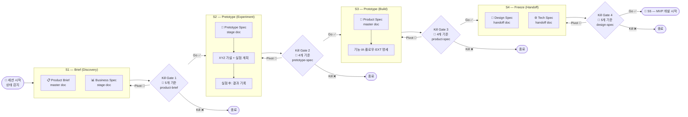
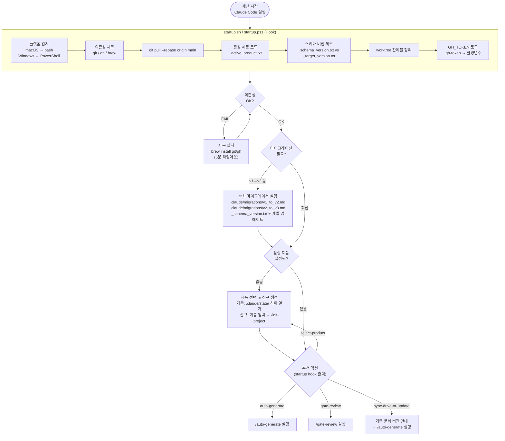
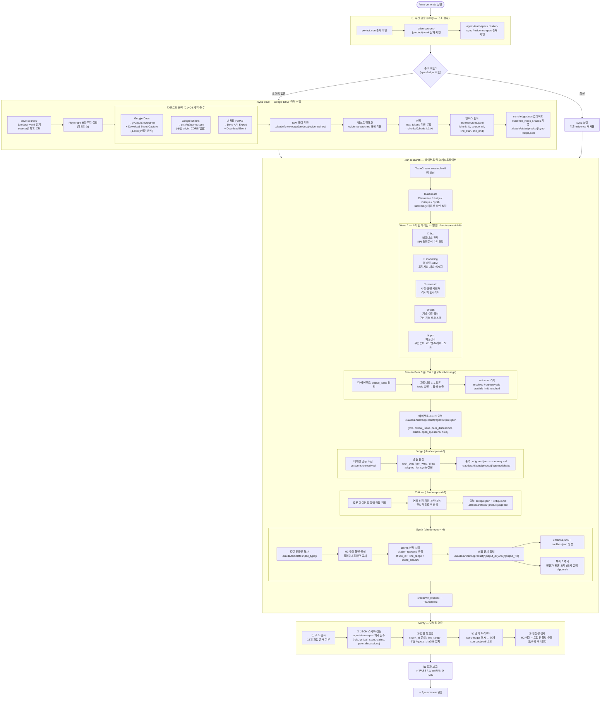
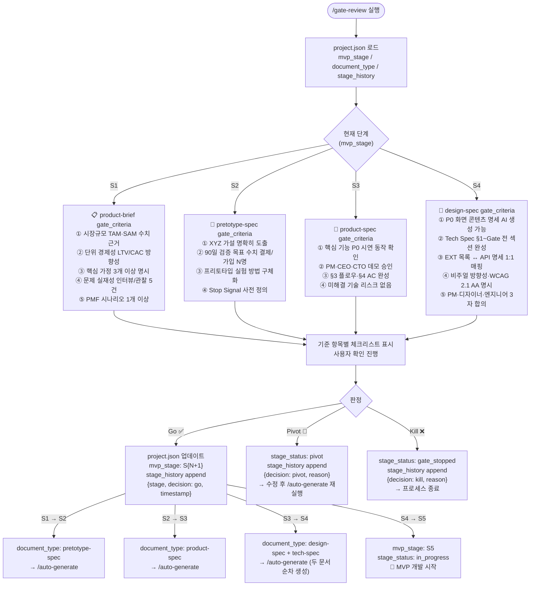
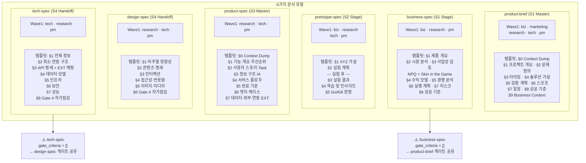
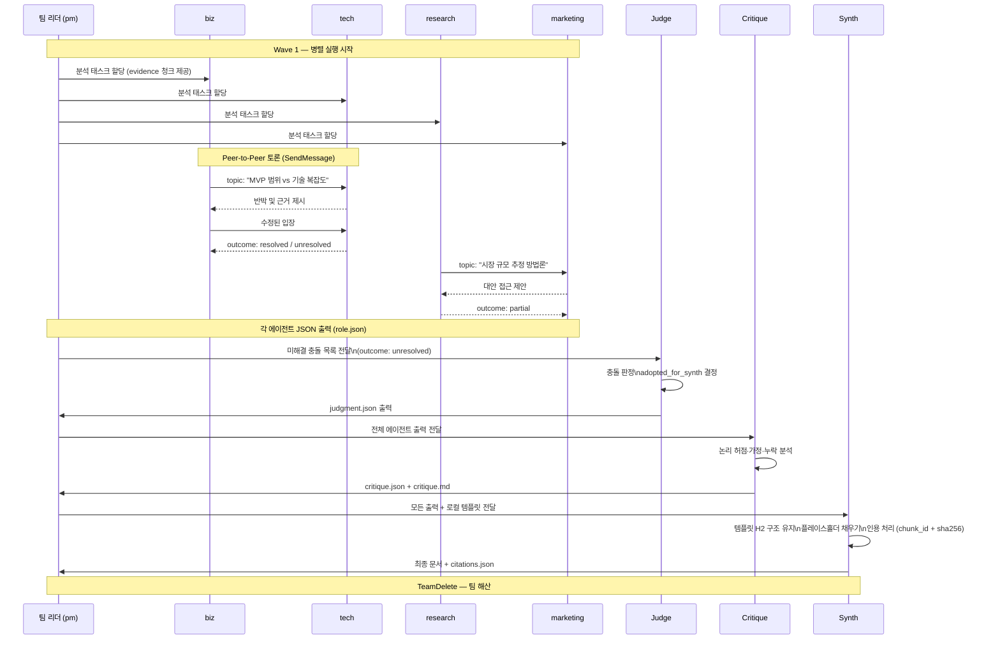
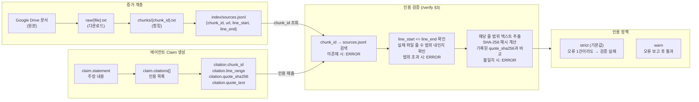

# MVP 프로세스 전체 다이어그램

> 이모코그 AI MVP 프로세스 v1.0 — 시스템 종합 시각화
> 생성일: 2026-03-03

---

## 다이어그램 1 — 전체 단계 흐름 (Stage Pipeline)

5단계 Kill Gate 기반 프로세스 전체 흐름. 각 단계에서 생성되는 문서와 게이트 기준을 보여줍니다.

---

## 다이어그램 2 — 세션 시작 & 상태 감지

세션이 시작될 때 Claude가 자동으로 수행하는 상태 감지 및 액션 결정 흐름입니다.

---

## 다이어그램 3 — Auto-Generate 파이프라인 (상세)

`/auto-generate` 실행 시 내부적으로 이루어지는 전체 파이프라인입니다.

---

## 다이어그램 4 — Gate Review 결정 흐름

각 단계별 게이트 기준과 Go/Pivot/Kill 결정 흐름입니다.

---

## 다이어그램 5 — 파일 시스템 & 데이터 흐름

각 명령이 읽고 쓰는 파일 경로와 데이터 흐름을 보여줍니다.

```mermaid
flowchart LR
    subgraph TRACKED ["📁 Tracked (git 관리)"]
        direction TB
        T1[".claude/commands/*.md\n명령어 정의"]
        T2[".claude/spec/\nagent-team-spec.md\ncitation-spec.md\nevidence-spec.md\ndocument-types.yaml\nmvp-process-spec.md"]
        T3[".claude/templates/{doc_type}/\n로컬 마크다운 템플릿"]
        T4[".claude/manifests/drive-sources.yaml\n템플릿 (tracked)"]
        T5[".claude/migrations/\nv1_to_v2.md / v2_to_v3.md"]
        T6["CLAUDE.md / env.yml\nREADME.md / CHANGELOG.md"]
    end

    subgraph GITIGNORED ["📁 Gitignored (사용자 데이터)"]
        direction TB
        subgraph STATE [".claude/state/"]
            ST1["_active_product.txt\n현재 활성 제품 포인터"]
            ST2["_schema_version.txt\n현재 스키마 버전"]
            ST3["{product}/project.json\nmvp_stage / document_type\nstage_history[]"]
            ST4["{product}/sync-ledger.json\nevidence_index_sha256\nlast_sync_at"]
        end

        subgraph MANIFEST_I [".claude/manifests/"]
            MI1["drive-sources-{product}.yaml\n제품별 Drive URL 목록"]
        end

        subgraph KNOWLEDGE [".claude/knowledge/{product}/evidence/"]
            K1["raw/\n원본 다운로드 텍스트"]
            K2["chunks/{chunk_id}.txt\n청킹된 증거 조각"]
            K3["index/sources.jsonl\n{chunk_id, url, line_start, line_end}"]
        end

        subgraph ARTIFACTS [".claude/artifacts/{product}/"]
            A1["agents/{role}.json\n에이전트 JSON 출력"]
            A2["agents/debate/\ndiscussions.json\njudgment.json / summary.md"]
            A3["agents/critique.json\nagents/critique.md"]
            A4["{output_dir}/v{N}/{output_file}\n최종 문서 (버전별)"]
            A5["{output_dir}/v{N}/citations.json\nconflicts.json"]
        end
    end

    subgraph COMMANDS ["명령어 데이터 흐름"]
        CMD1["/init-project"] -->|"생성"| ST3
        CMD1 -->|"생성"| MI1
        CMD2["/sync-drive"] -->|"읽기"| MI1
        CMD2 -->|"쓰기"| K1
        CMD2 -->|"쓰기"| K2
        CMD2 -->|"쓰기"| K3
        CMD2 -->|"업데이트"| ST4
        CMD3["/run-research"] -->|"읽기"| K3
        CMD3 -->|"읽기"| T2
        CMD3 -->|"읽기"| T3
        CMD3 -->|"쓰기"| A1
        CMD3 -->|"쓰기"| A2
        CMD3 -->|"쓰기"| A3
        CMD3 -->|"쓰기"| A4
        CMD3 -->|"쓰기"| A5
        CMD4["/verify"] -->|"읽기"| A1
        CMD4 -->|"읽기"| A2
        CMD4 -->|"읽기"| A3
        CMD4 -->|"읽기"| A4
        CMD4 -->|"읽기"| K3
        CMD5["/gate-review"] -->|"읽기"| ST3
        CMD5 -->|"읽기"| T2
        CMD5 -->|"업데이트"| ST3
    end
```

---

## 다이어그램 6 — 문서 유형별 에이전트 & 템플릿 매핑

각 문서 유형마다 어떤 에이전트가 참여하고 어떤 템플릿을 사용하는지 보여줍니다.

---

## 다이어그램 7 — 에이전트 간 토론 프로토콜 (Peer Messaging)

`/run-research` Wave 1에서 에이전트들이 서로 토론하는 방식입니다.

---

## 다이어그램 8 — 인용 처리 흐름 (Citation Spec)

에이전트의 claim이 인용을 통해 검증되는 흐름입니다.

